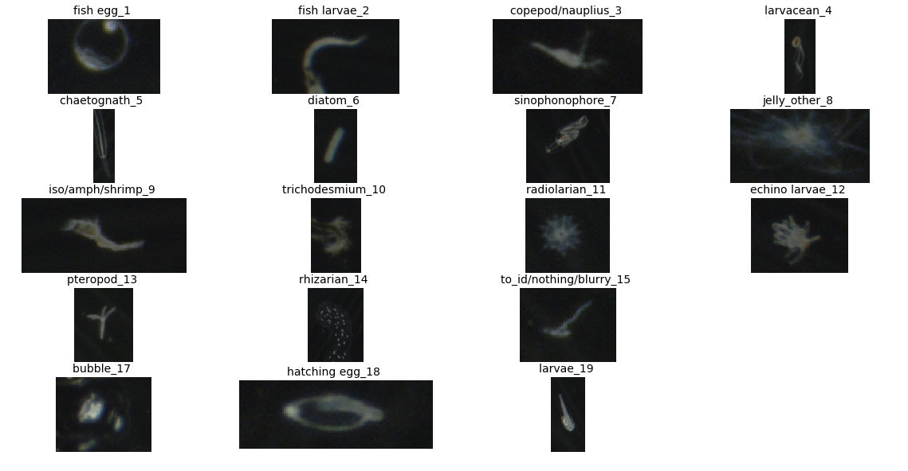

# README
Cayman - AlexNet Model trained for binary fish egg classification 

Overview
- Cayman is a collection of python scripts to train a CNN for binary fish egg classification, which serves the purpose for estimating Nassau Grouper population sizes.
- Version: 1.00a
- Authors: Kevin Le

## Prerequisites
- python 2.7. (with scikit-image and lmdb)
- caffe (with pycaffe)

## Tour
### Code
1. model.py: Defines the Classification Model
2. train.py: Training script
3. eval.py: Evaluation script
4. tools/dataset.py: Script for preparing datasets
5. tools/create_lmdb.py: Script following dataset creation by converting to lmdbs
6. tools/circle_detection.py: Object size detection script
7. tools/visualize_db.ipynb: Data visualization script

### Data
1. Training set: data/${VERSION}/data_train.csv
2. Validation set: data/${VERSION}/data_val.csv
3. Test (unlabelled) set: data/${VERSION}/data_test.csv

## Examples
To view the model perform image detection, the user can use the basic demo (HIGHLIGHT DEMO)
Run this ipython notebook

## Results
### Binary Fish Egg Classification

SHOW GIF OF BINARY FISH EGG DETECTION

## Content
1. Introduction
2. Problem
3. Dataset & Preprocessing
4. Model
5. Object Size Detection
6. Conclusion

## Part 1: Introduction
What are Nassau Groupers?
Where are they found?
Why are they interesting?
What research has come out of this interest?

From this field study, the massive amount of data to process by hand leads us to our problem.

## Part 2: Problem
#### The "Fishy" Dilemna
Given 225,000 images collected from the Cayman Field study, how do we determine the Nassau population size from this distribution? 

### Client
PhD Biologist Candidate from the Semmens Lab & Jaffe Lab

### Objective
Develop a model to detect all possible fish eggs from the sample and measure the size of the predicted fish eggs to determine it as a Nassau species

## Part 3: Dataset & Preprocessing
#### Dataset
With the need for fish egg detection, the dataset will be organized for binary fish egg classification. Originallly, the data
was given with up to 18 classes labeled. To train our classifier to perform well for fish egg detection, we need to
sample a minimum amount of images from 17 of the 18 classes and categorize it as our non fish egg, while the remaining class is defined as the fish egg class.
Below are image representations of the 18 classes:

After training the model and receiving reasonable performance on the validation set, the model will be deployed on the test set, which is the main objective of this project
in regards to detecting fish eggs. 

| Dataset      | # of Non Fish Egg Examples |# of Fish Egg Examples|Total Examples|
| -------------|:-------------:|:----------:|:----------:|
| Train        | 1115              | 1019           | 2134           |
| Validation   | 204              | 173           |  377          |
| Test         | ---              | ---           | 196169           |
Dataset statistics table

Below is another visual representation of the non-fish egg and fish egg classes

### Labeling
The labeling process for creating our datasets was conducted by PhD Biologist Candidate, Brian Stock, through a GUI interface coded in MATLAB. The data was randomly shuffled and Brian would
add a class category based on clusters of similar specimens seen in the dataset, resulting in our 18 classes. 

### Preprocessing
Preprocessing was an essential step, since our raw image was as raw as it could be. To process the network
to determine patterns, each image was converted into a color 8 bit. This brightened certain features of the
raw images. It was then resized while maintaining the aspect ratio. Finally, the images were 227x227.

## Part 4: Model
To begin the training step, the standard pretrained CNN model, AlexNet, is used as our preliminary model for classification. 
AlexNet is a light weight model, due to the number of parameters utilized and time to train, which is why it is typical to start off with it
to grasp a quick understanding of the dataset's complexities. 

Follow this link to view the parameters of our [Alexnet model](http://ethereon.github.io/netscope/#/gist/f86c5ed05f4a155bffbb814a345e0a5f)

### Error Metric
For this model, our error metric would mainly be accuracy. This appears to be the standard way, which we decided to keep up with.

### Training Scheme
Our AlexNet model trained for ~ 4500 iterations, which elapsed over 4 hours in time. 

### Results
Accuracy for fish egg/non-fish egg classes on validation set using AlexNet

- Accuracy: 97.61%
- Area Under Curve (AUC): 0.98

| Confusion Matrix        | ROC Curve           |
| ------------- |:-------------:|
|               |               |

Correctly predicted fish egg counts and size detection from test set after quality control from PhD biologist Brian Stock from the Semmens Lab at Scripps Institution of Oceanography
- / 3382 (%) predicted fish egg images
- / 3382 (%) valid object size detection

## Part 5: Object Size Detection
As mentioned previously, following the step of detecting the fish eggs from our test set, we would need
to solve the problem of how to measure these fish eggs. We decide to default for simple image processing
techniques for this problem, rather than a neural network, because it was deemd to be an "over kill" for
such a small project. 

### Computer Vision Algorithm
1) Schar Edge Detection
2) Dilation
3) Erosion
4) Detect minimum area of contours
5) Calculate midpoints across each side & distance between each as diameter

#### Schar Edge Detection

INSERT PICTURE OF SCHAR EDGE DETECTION

## Part 6: Conclusion
We now have a model and an object size detection to identify Nassau grouper. If you've read this far
into my article, I thank you very much and appreciate your interest in my work. I only hope the best for you
in your machine learning journey.

