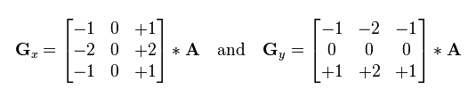

# Cayman Island Field Study
Cayman - AlexNet Model trained for binary fish egg classification 

Overview
- Cayman is a collection of python scripts to train a CNN for binary fish egg classification. Predictive modeling for this problem will translate into a 
mechanistic understanding of why the endangered reef fish, Nassau Grouper (Ephinephelus striatus) in the Cayman Islands, decline and recover in population size. Such an understanding
will ultimately help with protecting the species.
- Version: 1.00a
- Authors: Kevin Le

## Prerequisites
- python 2.7. (with scikit-image and lmdb)
- caffe (with pycaffe)

## Tour
### Code
1. model.py: Defines the Classification Model
2. train.py: Training script
3. eval.py: Evaluation script
4. tools/dataset.py: Script for preparing datasets
5. tools/create_lmdb.py: Script following dataset creation by converting to lmdbs
6. tools/circle_detection.py: Object size detection script
7. tools/visualize_db.ipynb: Data visualization script

### Data
1. Training set: data/${VERSION}/data_train.csv
2. Validation set: data/${VERSION}/data_val.csv
3. Test (unlabelled) set: data/${VERSION}/data_test.csv

## Examples
To view the model perform image detection, the user can use the [basic demo](https://github.com/ktl014/cayman/blob/master/examples/classify.ipynb) by running it. It can also be found in `examples`

## Results
### Binary Fish Egg Classification

  

### Object Size Detection

  

## Content
1. [Introduction](#Introduction)
2. [Problem](#Problem)
3. [Dataset & Preprocessing](#Dataset-&-Preprocessing)
4. [Training the Model](#Training-the-Model)
5. [Object Size Detection](#Object-Size-Detection)
6. [Conclusion](#Conclusion)

 

## Introduction

Fish population fluctuate alot due to environmental conditions, such as food and predator distributions. Other factors, such as fine-scale patichness also influences the survival of the fish larvae and eggs, but is impossible to resolve using traditional net sampling techniques. Therefore, in order to understand the population decline and recovery of fish, developing tools capable of observing such populations at a fine scale is necessary.
 
 
In a joint collaboration between Brice Semmen's and Jules Jaffe's Lab, an investigation was taken to understand the correlation of fine-scale patichness and the population of the endangered reef fish, Nassau Grouper, in the Cayman Islands.
Due to overfishing at their spawning aggregations, their population have drastically declined throughout the Caribbean. Their aggregation off the Cayman Islands is one of the largest remaining of the species and is continually increasing in size. This study will pertain to understanding how the eggs survive to become spawning adults.
 
 
In February 2017, a field study was deployed to study the Nassau spawning aggregation, specifically the density of eggs and other plankton at a fine spatial scale. The NetCam, an in situ plankton sampler developed for mechanistic understanding, was towed for three days to collect data during the Nassau's hatching phase. An example of the deployment path is below.

  
      
  Figure 1: 1) Drifters released at spawning 2) Underwater image of NetCam being towed 3) Sample of plankton images from NetCam

 
After this successful study of observing the fine-scale distribution of eggs during their dispersal, over 225,000 images needed to be processed to distinguish the Nassau Grouper eggs from eggs of other fish species and other plankton. Given the tremendous scale of data to be annotated, it is clear that it would be unrealistic for humans to perform such a task. To find value in this big data, new methods would be needed.

  
    
  Figure 2: Deployment path of Night 2 of the Field Study

 
 

## Problem

#### The "Fishy" Dilemna
Given 225,000 images collected from the Cayman Field study, how do we reliably determine the Nassau population size from this distribution of other fish eggs and planktons? 

### Objective
Train a convolutional neural network (CNN) model to detect all possible fish eggs from the sample and measure the size of the predicted fish eggs to determine it as a Nassau species. 
* It is found that there is a specific difference among the fish egg species, based on visual (egg size-frequency) and genetic (DNA barcoding) analysis. Eggs with diameters between 0.89 - 1.10 mm are classified as Nassau Grouper.
 
 

## Dataset & Preprocessing
#### Dataset
With the need for fish egg detection, the dataset will be organized for binary fish egg classification. Originallly, the data
was given with up to 18 classes labeled. To train our classifier to perform well for fish egg detection, we need to
sample a minimum amount of images from 17 of the 18 classes and categorize it as our non fish egg, while the remaining class is defined as the fish egg class.
Below are image representations of the 18 classes:

  Figure 3: Classes 1-19 found in Cayman dataset

After training the model and receiving reasonable performance on the validation set, the model will be deployed on the test set, which is the main objective of this project
in regards to detecting fish eggs. 

| Dataset      | # of Non Fish Egg Examples |# of Fish Egg Examples|Total Examples|
| -------------|:-------------:|:----------:|:----------:|
| Train        | 1115              | 1019           | 2134           |
| Validation   | 204              | 173           |  377          |
| Test         | ---              | ---           | 196169           |

  Dataset Statistics Table

Below is another visual representation of the non-fish egg and fish egg classes

  
      
  Figure 4: Non-fish egg and fish egg example

### Labeling
The labeling process for creating our datasets was conducted by PhD Biologist Candidate, Brian Stock, through a GUI interface coded in MATLAB. The data was randomly shuffled and Brian would add a class category based on clusters of similar specimens seen in the dataset, resulting in our 18 classes. 

  
    
  Figure 5: MATLAB GUI used for labeling training data

### Preprocessing
Preprocessing was an essential step, since our raw image was as raw as it could be. To process the network
to determine patterns, each image was converted into a color 8 bit. This brightened certain features of the
raw images. It was then resized while maintaining the aspect ratio. Finally, the images were 227x227.
 
 

## Training the Model
To begin the training step, the standard pretrained CNN model, AlexNet, is used as our preliminary model for classification. 
AlexNet is a light weight model, due to the number of parameters utilized and time to train, which is why it is typical to start off with it
to grasp a quick understanding of the dataset's complexities. 

  Figure 6: AlexNet architecture

Follow this link to view the parameters of our [Alexnet model](http://ethereon.github.io/netscope/#/gist/f86c5ed05f4a155bffbb814a345e0a5f)

### Error Metric
For this model, our error metric would mainly be accuracy. This appears to be the standard way, which we decided to keep up with.

### Training Scheme
Our AlexNet model trained for ~ 4500 iterations, which elapsed over 4 hours in time. 

### Results
Accuracy for fish egg/non-fish egg classes on validation set using AlexNet

- Accuracy: 97.61%
- Area Under Curve (AUC): 0.98

| Confusion Matrix        | ROC Curve           |
| ------------- |:-------------:|
|               |               |

Correctly predicted fish egg counts and size detection from test set after quality control from PhD biologist Brian Stock from the Semmens Lab at Scripps Institution of Oceanography
- / 3382 (%) predicted fish egg images
- / 3382 (%) valid object size detection
 
 

## Object Size Detection
As mentioned previously, following the step of detecting the fish eggs from our test set, we would need
to solve the problem of how to measure these fish eggs. We decide to default for simple image processing
techniques for this problem, rather than a neural network, given the number of predicted fish eggs. 

### Computer Vision Algorithm
1. Scharr Edge Detection
2. Dilation
3. Erosion
4. Detect minimum area of contours
5. Calculate midpoints across each side & distance between each as diameter

#### Scharr Edge Detection
Edge detection is one of the most fundamental operations known to image processing. It helps with processing the necessary
amount of pixels for an image while maintaing the structural aspect of it. The Scharr edge detection scheme involves using gradients
to detect the edges, since the pixel intensity significantly changes. The "changing" aspect is key to the utilization of gradients, since they
point in the steepest direction of change. This scheme is different from other processing, such as Sobel and Laplace, due to use of a 3x3 kernel for providing
more accurate derivatives when convolving with the image.

If we define A as the source image and Gx and Gy are two images where the points contain vertical and horizontal approximations, then we are given enough
information to calculate our gradient.

  

#### Dilation & Erosion
Both dilation and erosion are morphology operators, used to apply a structuring element to an input image and generate an output image. They have a wide array of uses, such as removing noise, detecting intensity bumps or holes in an image, etc. The operation of dilation involves convolving an image with a kernel to replace current values with its maximum values, smoothening the image structure while maintaining shape and size. It could be thought of as the open filter. On the other hand, erosion is the opposite, which replaces the current pixel with its minimum vaues in order to remove noise and simplify the image.

  
        
  Figure 7: Morphology Operators. 1) Resulting Dilation 2) Original Image 3) Resulting Erosion

#### Detecting the Contours
After applying our edge detection and morphology operations, our process simplifies down to detecting the contours from the resulting output, which is done through the OpenCV API. The contours will serve as the localization of the fish egg, leaving us with a few geometry and camera magnification conversion steps to determine the egg diameter size. 

 
 

## Conclusion

We trained a CNN model for binary fish egg classification to assist with annotating over 225,000 images and developed an object size detection algorithm for Nassau Grouper classification. We anticipate that future deployment of this new software could assist with real-time image recognition during field studies and shed further light on the fine-scale processes influencing fish population success.

